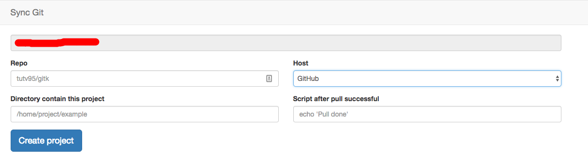
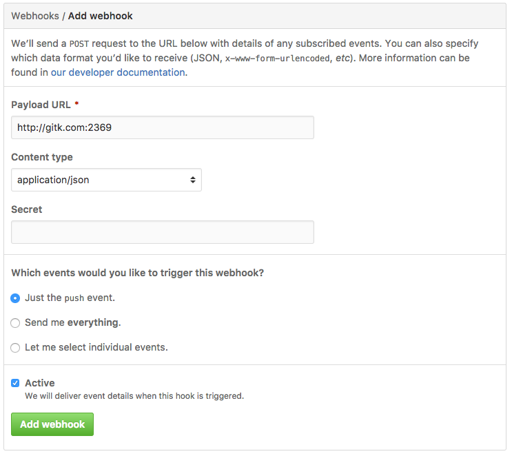

# GitK

[](https://greenkeeper.io/)
Sync project from remote git server to local server

# Installation

```
git clone https://github.com/tutv95/gitk.git
```

- Config app: Copy file `.env.example` to '.env'
```
HOST_PORT=2369
```

- Install dependency packages and run app.
```
npm start
```

- Open browser: your-domain.com:HOST_PORT (e.g: http://gitk.com:2369)

- Add project to app.


- Go to settings webhook of repository and add new webhook:
